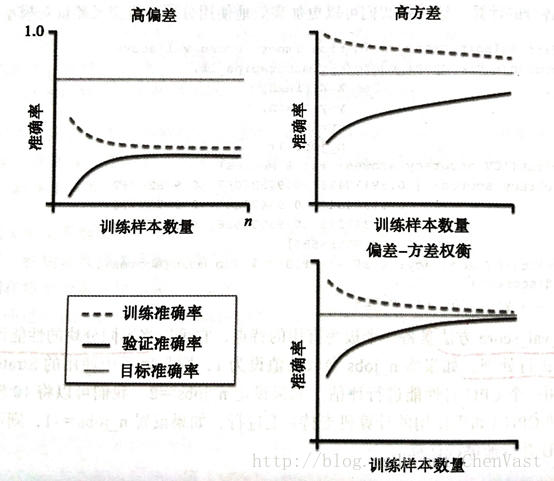

# 泛化能力
泛化能力（generalization ability）是指机器学习算法对新鲜样本的适应能力。学习的目的是学到隐含在数据对背后的规律，对具有同一规律的学习集以外的数据，经过训练的网络也能给出合适的输出，该能力称为泛化能力。通常期望经训练样本训练的网络具有较强的泛化能力，也就是对新输入给出合理响应的能力。应当指出并非训练的次数越多越能得到正确的输入输出映射关系。网络的性能主要用它的泛化能力来衡量。[^footer1]

# 欠拟合
> 预测准确率低

对于训练好的模型，若在训练集表现差，在测试集表现同样会很差，这可能是欠拟合导致。欠拟合是指模型拟合程度不高，数据距离拟合曲线较远，或指模型没有很好地捕捉到数据特征，不能够很好地拟合数据。[^footer1]

## 可能原因
- 模型过于简单，难以泛化新的数据
- 算法并不适用于特定的数据结构
- 训练质量不好，噪声点过多或数据量太少

## 解决办法
- 构建更多特征，此时扩展数据量是不行的
- 减小正则项

# 过拟合
模型过于复杂或者没有足够的数据支持模型的训练时，模型含有训练集的特有信息，对训练集过于依赖，即模型会对训练集高度敏感，这种现象称之为模型过拟合。

## 解决办法
- 增大数据集
- 降低模型复杂度
- 增大正则项
- 减少特征

# learning curve（学习曲线）
学习曲线就是通过画出不同训练集大小时训练集和交叉验证的准确率，可以看到模型在新数据上的表现，进而来判断模型是否方差偏高或偏差过高，以及增大训练集是否可以减小过拟合。[^footer2]

## 分析这个曲线
主要评判依据是训练准确率和测试准确率。
- 两者收敛（即两曲线即将重合）但准确率很低时，为高偏差，即欠拟合
- 两者不收敛（即两曲线相差较大）但准确率很高，为高方差，即过拟合

[^footer1]: 百度百科-欠拟合
[^footer2]: https://blog.csdn.net/aliceyangxi1987/article/details/73598857

